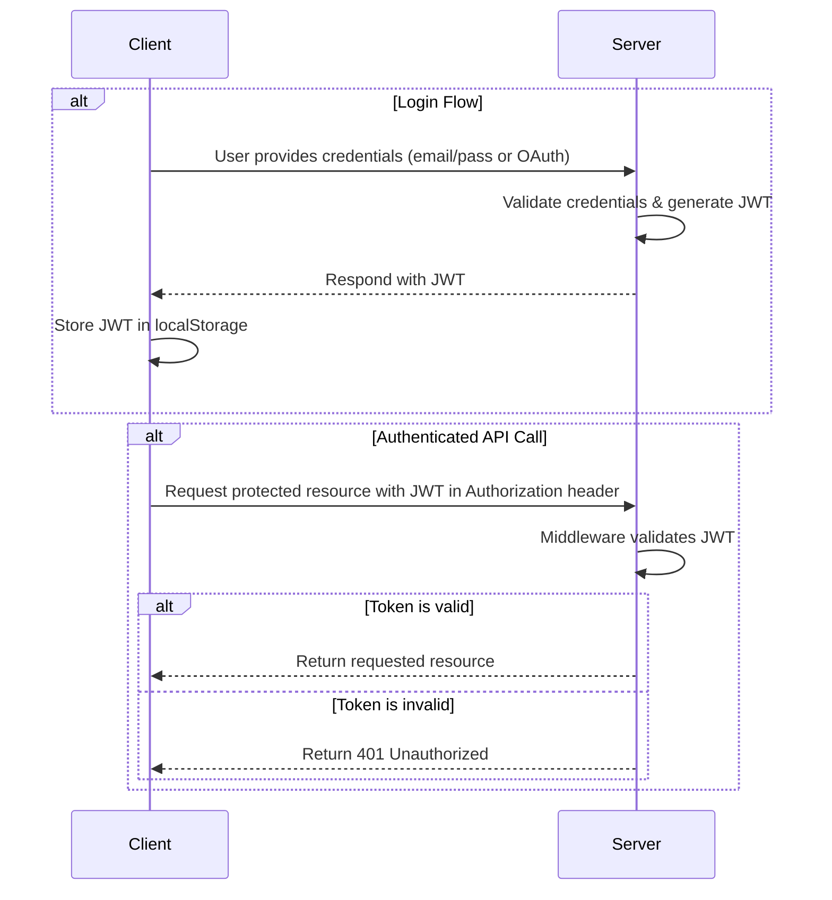

# LinkSlam

> Your Ultimate Bookmarking Platform 🚀

LinkSlam is a full-stack bookmarking and link-sharing app where you can save, organize, and share useful URLs — like a digital locker meets a social feed for links.

---

## 🔥 Features

*   **Robust Authentication**
    *   Email & Password (JWT in `localStorage`)
    *   Google OAuth 2.0 with Passport.js

*   **My Slam Zone (Personal Dashboard)**
    *   Create, read, update, and delete your links.
    *   Toggle link visibility between **Public** and **Private**.
    *   Filter links by status (All, Public, Private).
    *   Search your personal links by title, URL, or tags.

*   **Public Feed (Community Hub)**
    *   Discover links shared by the entire community.
    *   Search for public links or users.
    *   Filter the feed by popular tags.
    *   Like and save links from other users to your own collection.

*   **User Profiles**
    *   View public profiles of other users and their shared links.
    *   Edit your own profile, including your username and profile picture.

*   **Modern UI/UX**
    *   Responsive, dark-mode-first design.
    *   Masonry-style grid layout for a visually appealing feed.
    *   Toasts for user feedback and error handling.
    *   Modals for creating/editing links and profiles without leaving the page.

---

## 🛠️ Tech Stack

| Category      | Technology                                                                                             |
| ------------- | ------------------------------------------------------------------------------------------------------ |
| **Frontend**  | [Next.js](https://nextjs.org/) 14 (App Router), [React](https://react.dev/), [TypeScript](https://www.typescriptlang.org/) |
| **Styling**   | [Tailwind CSS](https://tailwindcss.com/), [Shadcn/UI](https://ui.shadcn.com/), [Lucide React](https://lucide.dev/) |
| **State**     | React Context + Hooks                                                                                  |
| **Backend**   | [Node.js](https://nodejs.org/), [Express.js](https://expressjs.com/)                                    |
| **Database**  | [MongoDB](https://www.mongodb.com/), [Mongoose](https://mongoosejs.com/)                                |
| **Auth**      | [Passport.js](http://www.passportjs.org/) (Google OAuth), [JWT](https://jwt.io/)                        |
| **File Uploads**| [Cloudinary](https://cloudinary.com/) for profile images                                               |
| **UI Libs**   | `sonner` (toasts), `react-masonry-css` (layout)                                                        |

---

## 📁 Project Structure

```
linkslam/
├── client/ (Next.js Frontend)
│   ├── src/
│   │   ├── app/
│   │   │   ├── (auth)/         → Login, Signup, Onboarding
│   │   │   ├── my-zone/        → User's private dashboard
│   │   │   ├── public-feed/    → Global community feed
│   │   │   └── profile/        → User profile pages
│   │   ├── components/         → Reusable UI components (Cards, Modals, Headers)
│   │   ├── services/           → Centralized API call handlers (axios)
│   │   └── contexts/           → Global state (User Context)
│   └── public/                 → Static assets and images
│
└── server/ (Express.js Backend)
    ├── src/
    │   ├── controllers/        → Request handling logic for each route
    │   ├── models/             → Mongoose schemas for Users and Links
    │   ├── routes/             → API endpoint definitions
    │   ├── middlewares/        → Authentication (JWT) and file upload handlers
    │   └── config/             → Database, Passport.js, and Cloudinary setup
```

---

## 🧪 Running Locally

### Prerequisites

*   Node.js v18+
*   MongoDB instance (local or cloud-hosted on Atlas)
*   Cloudinary account for image uploads

### Setup

1.  **Clone the repository:**
    ```bash
    git clone https://github.com/your-username/linkslam.git
    cd linkslam
    ```

2.  **Configure Environment Variables:**
    Create a `.env` file in both the `client` and `server` directories.

    **`server/.env`**
    ```env
    MONGO_URI=your_mongodb_connection_string
    JWT_SECRET=your_super_secret_key
    CLIENT_URL=http://localhost:3000
    GOOGLE_CLIENT_ID=your_google_client_id
    GOOGLE_CLIENT_SECRET=your_google_client_secret
    CLOUDINARY_CLOUD_NAME=your_cloudinary_cloud_name
    CLOUDINARY_API_KEY=your_cloudinary_api_key
    CLOUDINARY_API_SECRET=your_cloudinary_api_secret
    ```

    **`client/.env.local`**
    ```env
    NEXT_PUBLIC_SERVER_URL=http://localhost:8080
    ```

3.  **Install Dependencies & Run:**

    ```bash
    # Terminal 1: Run the Backend
    cd server
    npm install
    npm run dev

    # Terminal 2: Run the Frontend
    cd client
    npm install
    npm run dev
    ```

Open [http://localhost:3000](http://localhost:3000) in your browser.

---

## 🔁 Auth Flow (Token-Based)

The application uses a token-based authentication flow with JWT stored in the browser's `localStorage`.



---

## 🧠 Future Ideas

*   **Advanced Analytics:** Track link clicks, top referrers, and save counts.
*   **Browser Extension:** Quickly save links from anywhere on the web.
*   **AI-Powered Tagging:** Automatically suggest tags based on link content.
*   **Team Spaces:** Create shared bookmark collections for teams.

---

## 👨‍💻 Built by Archit

Engineering student @ USICT, GGSIPU.

Built LinkSlam because I was tired of my bookmarks turning into digital graveyards. Hope this helps you stay organized, inspired, and a little more internet-chaotic 🌈

⭐ Star this project if LinkSlam fixed your tab-hoarding addiction